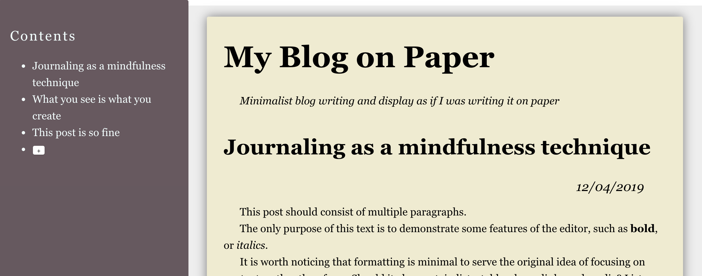

# Paper Journal App

Paper is a journaling tool that can help you keep your notes in a simple and accessible form while providing real feel of a physical journal.

## Key features

- Edit what you see right in place
- Save data in plain hypertext
- Publish as a static site if you want

## Roadmap

1. MVP _(current)_
  - Overall look and feel of the app
  - Provides basic adding, editing, ordering of posts
  - Saves data on disk
2. Journal settings and theme
  - Opens local projects with a provided path
  - Project settings are stored alongside with project data
  - Theme is saved with a project, projects can have different themes via CSS
3. Bookmarks
  - Locate sections and posts via bookmarks (local URLs), requires router
  - Add bookmarks with managment operations to the sidebar 
4. Search
  - Search posts by keywords, displaying the matching posts with the keywords highlighted
5. Publishing
  - Export a read-only compiled HTML of a journal that can be published on web

## MVP

The app consists of two panels. The left panel is a sidebar displaying a tree table of contents of the blog. Contents can be sorted by drag & drop. New posts can be created by clicking a "+" button. Posts can be deleted via context menu.

The right panel displays posts as a single feed. Editing posts and creating content is seamless (think of Medium). For the MVP just standard formatting is enough. Media content is extra.

Data is saved as local HTML files. This can be done either via thin Node.js server, or by packaging it as an Electron app.

### Plan

#### Mock :white_check_mark:

A static mockup with the outline of the future application:

- Sidebar panel on the left with Table of contents as a list. Last item of the list is a "+" button to add a new post.
- Main content area on the right with A4-sized pages displaying posts. Each post has: `title`, `date`, `text` (formatted).

#### React components :white_check_mark:

The app is still static but the layout is converted into React components:

- App
  - Sidebar
    - Navigation
      - NavItem
      - NewPost
  - Content
    - Post
      - Date
      - Text

#### Interactive content :white_check_mark:

On this stage interactivity is added, so posts become editable and new posts can be added to the app. However, state is neither propagated throughout the app, nor persisted.

#### State management :clock2:

Time to introduce Redux for state management and to bring Content and Sidebar together.

Additionally, operations like deleting posts should be implemented.

#### Ordering content

Posts can be ordered via Drag & Drop in the sidebar.

_Additional: could intoduce hierarchy like Categories or Chapters at this step and implement nesting together with Drag & Drop._

#### Persistence

At this point we have complete state management and all changes avialable in the UI, but these changes are not saved between sessions.

Here we connect the store with either a simple Node.js server or move the app to Electron, and implement a persistent storage and loading from local file system.
